# **DAZZER LEAN ARCHITECTURE**

## **Complete Context for AI Agents (Cursor/Claude)**

---

## **CRITICAL CONTEXT FOR AI AGENTS**

**YOU ARE BUILDING:** A system that detects code patterns that confuse AI, improving AI-generated code acceptance from 30% to 60%+

**ARCHITECTURE:**

- **1 Scanner Service** (Python, ~1000 lines) - Handles EVERYTHING except detection
- **N Detector Services** (Python, 150-300 lines each) - Each in separate repository
- **PostgreSQL** - All data storage (no Redis, no Firestore)
- **Cloud Run** - All services deployed here (no Kubernetes)

**KEY RULES:**

1. Source code NEVER leaves customer machine - only AST
2. Each detector is independent - can be added/removed without touching Scanner
3. Use PostgreSQL for everything - no other databases
4. Keep it simple - no queues, no pub/sub, just HTTP

---

## **SYSTEM OVERVIEW**

### **Mission**

Detect code patterns that confuse AI, improving AI-generated code acceptance from 30% to 60%+

### **What Makes Code "AI-Ready"**

- No magic numbers (unexplained constants)
- Consistent naming patterns
- Low complexity (AI can't handle 50-line functions)
- No code duplication (confuses context)
- Clear dependencies (no circular imports)
- Documented business logic

---

## **COMPLETE ARCHITECTURE**

```mermaid
graph TB
    subgraph Local Machine - Privacy Preserved
        Code[Source Code - NEVER SENT]
        CLI[dazzer CLI<br/>Go Binary<br/>tree-sitter AST]
        Code -->|Converted locally| CLI
    end
    
    subgraph GCP Cloud Run - Project: dazzer-prod
        Scanner[scanner-service<br/>Python/FastAPI<br/>~1000 lines max]
        
        subgraph Auto-Discovered Detectors
            D1[detector-magic]
            D2[detector-naming]
            D3[detector-complexity]
            DN[detector-&#123;new&#125;]
        end
    end
    
    subgraph GCP Storage
        DB[(PostgreSQL<br/>CloudSQL)]
        GCS[GCS Bucket<br/>ASTs &gt; 10MB]
    end
    
    CLI -->|1.POST /scan<br/>&#123;ast, token&#125;| Scanner
    Scanner -->|2.Validate| DB
    Scanner -->|3.Store scan| DB
    Scanner -->|4.If size &gt; 10MB| GCS
    Scanner -->|5.Parallel HTTP| D1
    Scanner -->|5.Parallel HTTP| D2
    Scanner -->|5.Parallel HTTP| D3
    Scanner -->|5.Parallel HTTP| DN
    D1 -->|6.Findings| Scanner
    D2 -->|6.Findings| Scanner
    D3 -->|6.Findings| Scanner
    DN -->|6.Findings| Scanner
    Scanner -->|7.Aggregate| Scanner
    Scanner -->|8.Calculate Score| Scanner
    Scanner -->|9.Store results| DB
    Scanner -->|10.Return report| CLI
```



---

## **DETECTOR DISCOVERY - PLUG AND PLAY**

### **How Scanner Finds Detectors (Convention-Based)**

```python
# Scanner service - detector discovery
DETECTOR_BASE_URL = "https://detector-{name}-dazzerprod.run.app"
DETECTOR_NAMES = ["magic", "naming", "complexity"]  # Start hardcoded

# Phase 2: Move to PostgreSQL
def get_active_detectors():
    # Query from database when > 10 detectors
    return db.query("SELECT name, url FROM detectors WHERE active = true")

# Adding new detector:
# 1. Deploy: gcloud run deploy detector-awesome
# 2. Add to list (Phase 1) or database (Phase 2)
# 3. Next scan automatically includes it
```

---

## **COMPLETE DATABASE SCHEMA**

```sql
-- Users & Authentication
CREATE TABLE users (
    token VARCHAR(50) PRIMARY KEY,
    email VARCHAR(100) NOT NULL,
    company VARCHAR(100),
    created_at TIMESTAMP DEFAULT NOW(),
    last_active TIMESTAMP,
    metadata JSONB DEFAULT '{}'
);

-- Scan Records
CREATE TABLE scans (
    id UUID PRIMARY KEY DEFAULT gen_random_uuid(),
    user_token VARCHAR(50) REFERENCES users(token),
    status VARCHAR(20) DEFAULT 'processing',  -- processing, complete, failed
    
    -- Results
    ai_readiness_score INTEGER,  -- 0-100
    total_findings INTEGER,
    critical_count INTEGER DEFAULT 0,
    high_count INTEGER DEFAULT 0,
    medium_count INTEGER DEFAULT 0,
    low_count INTEGER DEFAULT 0,
    
    -- Metadata
    file_count INTEGER,
    total_size_bytes BIGINT,
    language_distribution JSONB,  -- {"python": 0.6, "go": 0.4}
    ast_gcs_url VARCHAR(500),  -- For large ASTs
    
    -- Timing
    created_at TIMESTAMP DEFAULT NOW(),
    completed_at TIMESTAMP,
    duration_ms INTEGER,
    
    metadata JSONB DEFAULT '{}'
);

-- Findings (Generic for ALL detector types)
CREATE TABLE findings (
    id SERIAL PRIMARY KEY,
    scan_id UUID REFERENCES scans(id) ON DELETE CASCADE,
    
    -- Detector info
    detector_name VARCHAR(50) NOT NULL,
    detector_version VARCHAR(20) DEFAULT '1.0.0',
    
    -- Location (REQUIRED for all findings)
    file_path TEXT NOT NULL,
    start_line INTEGER NOT NULL,
    end_line INTEGER NOT NULL,
    start_column INTEGER,
    end_column INTEGER,
    
    -- Finding details
    severity VARCHAR(10) NOT NULL,  -- critical, high, medium, low
    finding_type VARCHAR(50) NOT NULL,  -- magic_number, duplication, etc
    message TEXT NOT NULL,
    suggestion TEXT,
    code_snippet TEXT,  -- The problematic code
    
    -- AI-specific
    ai_impact JSONB DEFAULT '{}',  -- {"confusion_level": "high", "reason": "..."}
    
    -- Extensible for any detector
    raw_data JSONB DEFAULT '{}',  -- Detector-specific data
    
    created_at TIMESTAMP DEFAULT NOW()
);

-- Analytics Events
CREATE TABLE analytics_events (
    id SERIAL PRIMARY KEY,
    user_token VARCHAR(50) REFERENCES users(token),
    scan_id UUID REFERENCES scans(id),
    event_type VARCHAR(50),  -- scan_started, scan_completed, detector_failed
    event_data JSONB,
    timestamp TIMESTAMP DEFAULT NOW()
);

-- Indexes for Performance
CREATE INDEX idx_scans_user_created ON scans(user_token, created_at DESC);
CREATE INDEX idx_findings_scan_severity ON findings(scan_id, severity);
CREATE INDEX idx_findings_type ON findings(finding_type);
CREATE INDEX idx_analytics_user_time ON analytics_events(user_token, timestamp);
```

---

## **STANDARD INTERFACES**

### **Detector Input (ALL detectors receive this)**

```json
{
    "scan_id": "550e8400-e29b-41d4-a716",
    "ast": {
        "files": [
            {
                "path": "src/main.py",
                "language": "python",
                "ast_nodes": {...},
                "content": "source code"
            }
        ]
    },
    "ast_url": "https://storage.googleapis.com/..."  // If AST > 10MB
}
```

### **Detector Output (ALL detectors return this)**

```json
{
    "detector": "magic-numbers",
    "version": "1.0.0",
    "scan_id": "550e8400-e29b-41d4-a716",
    "findings": [
        {
            "file": "src/main.py",
            "start_line": 42,
            "end_line": 42,
            "start_column": 10,
            "end_column": 15,
            "severity": "medium",
            "type": "magic_number",
            "message": "Magic number 86400 should be a named constant",
            "suggestion": "SECONDS_IN_DAY = 86400",
            "code_snippet": "if elapsed > 86400:",
            "ai_impact": {
                "level": "high",
                "reason": "AI won't understand this represents seconds in a day"
            },
            "raw_data": {
                "value": 86400,
                "context": "time comparison"
            }
        }
    ],
    "metrics": {
        "files_scanned": 45,
        "execution_time_ms": 234
    }
}
```

### **AI-Readiness Report Format**

```json
{
    "scan_id": "550e8400-e29b-41d4-a716",
    "ai_readiness_score": 72,  // 0-100
    "summary": {
        "total_issues": 47,
        "critical": 2,
        "high": 8,
        "medium": 23,
        "low": 14,
        "top_issue": "Code duplication causing context confusion"
    },
    "recommendations": [
        {
            "priority": 1,
            "action": "Extract magic numbers in payment module",
            "impact": "Will improve AI understanding by 15%",
            "effort": "low"
        },
        {
            "priority": 2,
            "action": "Standardize function naming patterns",
            "impact": "Will reduce AI errors by 10%",
            "effort": "medium"
        }
    ],
    "findings_by_category": {
        "magic_numbers": 12,
        "naming_inconsistency": 8,
        "high_complexity": 5,
        "duplication": 15
    },
    "trends": {
        "score_change": "+5",  // vs last scan
        "issues_resolved": 3,
        "new_issues": 1
    }
}
```

---

## **ANALYTICS TRACKING (COMPLETE)**

### **What We Track**

```sql
-- User Behavior Analytics
SELECT 
    user_token,
    COUNT(DISTINCT scan_id) as total_scans,
    COUNT(DISTINCT DATE(created_at)) as active_days,
    AVG(ai_readiness_score) as avg_score,
    AVG(duration_ms) as avg_scan_time,
    MAX(created_at) as last_active,
    MIN(created_at) as first_scan,
    AVG(file_count) as avg_repo_size,
    COUNT(DISTINCT scan_id) FILTER (WHERE created_at > NOW() - INTERVAL '7 days') as scans_this_week
FROM scans
GROUP BY user_token;

-- Repository Patterns
SELECT 
    scan_id,
    COUNT(*) FILTER (WHERE created_at > LAG(created_at) OVER (PARTITION BY user_token ORDER BY created_at)) as repeat_scans,
    EXTRACT(EPOCH FROM (created_at - LAG(created_at) OVER (PARTITION BY user_token ORDER BY created_at))) as time_between_scans
FROM scans;

-- Detector Performance
SELECT 
    detector_name,
    COUNT(*) as total_findings,
    AVG(CASE WHEN severity = 'critical' THEN 4 
             WHEN severity = 'high' THEN 3 
             WHEN severity = 'medium' THEN 2 
             ELSE 1 END) as avg_severity,
    COUNT(DISTINCT scan_id) as scans_with_findings
FROM findings
GROUP BY detector_name;

-- Error Tracking
SELECT 
    event_type,
    COUNT(*) as occurrences,
    event_data->>'error' as error_message,
    COUNT(DISTINCT user_token) as affected_users
FROM analytics_events
WHERE event_type LIKE '%error%'
GROUP BY event_type, error_message;
```

---

## **INSTRUCTIONS FOR CURSOR/AI AGENTS**

### **Project Structure**

```
dazzer/
├── scanner-service/          # Main orchestration service
│   ├── main.py              # FastAPI application (~800 lines)
│   ├── auth.py              # Token validation (~50 lines)
│   ├── detectors.py         # Detector discovery (~100 lines)
│   ├── aggregator.py        # Result aggregation (~150 lines)
│   └── requirements.txt     # FastAPI, asyncpg, aiohttp
│
├── detector-magic/           # Separate repository
│   ├── main.py              # FastAPI endpoint (~50 lines)
│   ├── detector.py          # Detection logic (~200 lines)
│   └── requirements.txt     # Minimal dependencies
│
├── detector-naming/          # Separate repository
│   └── (same structure)
│
└── dazzer-cli/              # Go CLI
    └── main.go              # AST generation, API calls
```

### **Key Implementation Rules**

1. **Scanner Service Rules:**
    - NEVER exceed 1500 lines total
    - Use `asyncio.gather()` for parallel detector calls
    - 10-second timeout per detector
    - Return partial results if some detectors fail
    - Log everything to analytics_events table
2. **Detector Rules:**
    - Each detector in SEPARATE repository
    - Maximum 300 lines of code
    - Must return standard schema
    - Must handle both direct AST and GCS URL
    - Must include line numbers in findings
3. **Database Rules:**
    - Use PostgreSQL for EVERYTHING
    - No Redis, no Firestore
    - Use JSONB for flexible fields
    - Always include indexes
4. **Error Handling Pattern:**
    
    ```python
    try:
        result = await call_detector(url, ast)
    except asyncio.TimeoutError:
        log_event("detector_timeout", {"detector": name})
        return {"detector": name, "error": "timeout", "findings": []}
    except Exception as e:
        log_event("detector_error", {"detector": name, "error": str(e)})
        return {"detector": name, "error": str(e), "findings": []}
    ```
    

---

## **GROWTH TRIGGERS (WHEN TO EVOLVE)**

| Signal | Action |
| --- | --- |
| Cursor makes 3+ errors per session | Split scanner service |
| Response time p95 > 5 seconds | Add caching layer |
| More than 10 detectors | Move list to PostgreSQL |
| AI detectors take > 2 minutes | Add async processing |
| 100+ concurrent users | Add Redis cache |
| Scanner > 1500 lines | Split into scanner + aggregator |

---

## **SUCCESS CRITERIA**

### **MVP (Phase 1)**

- [ ]  Scanner service deployed on Cloud Run
- [ ]  1 detector working
- [ ]  CLI generates AST and gets report
- [ ]  10 manual tokens created
- [ ]  Response time < 30 seconds

### **Beta (Phase 2)**

- [ ]  8-10 detectors deployed
- [ ]  50 users onboarded
- [ ]  Analytics dashboard working
- [ ]  AI readiness scores improving
- [ ]  GCS integration for large repos

### **Production (Phase 3)**

- [ ]  100+ users active
- [ ]  15+ detectors
- [ ]  Automated detector discovery
- [ ]  < 10 second response time
- [ ]  99% uptime

---

This enhanced architecture document:

1. **Provides complete context** for AI agents
2. **Covers ALL requirements** from your list
3. **Includes concrete examples** of inputs/outputs
4. **Specifies exact schemas** with all required fields
5. **Details analytics tracking** comprehensively
6. **Clarifies plug-and-play** mechanism
7. **Provides clear growth triggers** based on actual degradation

The document now explicitly tells Cursor/AI agents exactly what to build, how to structure it, and when to evolve it.